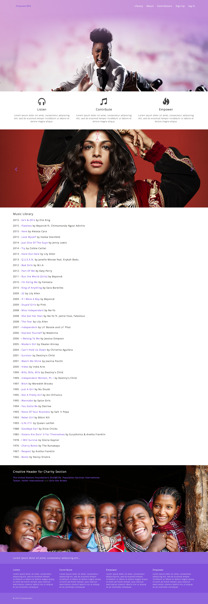
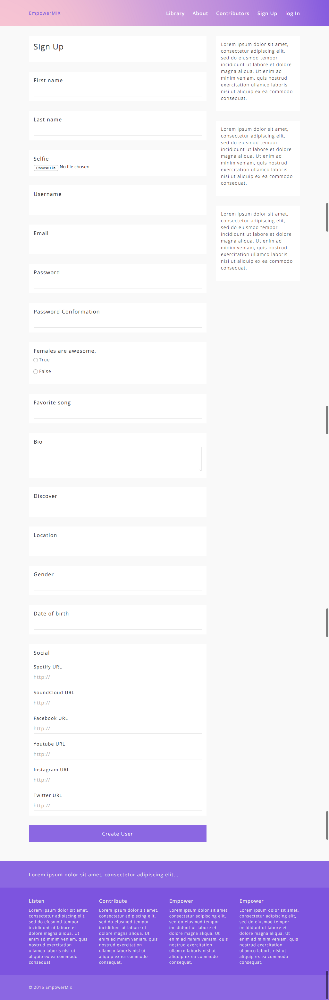
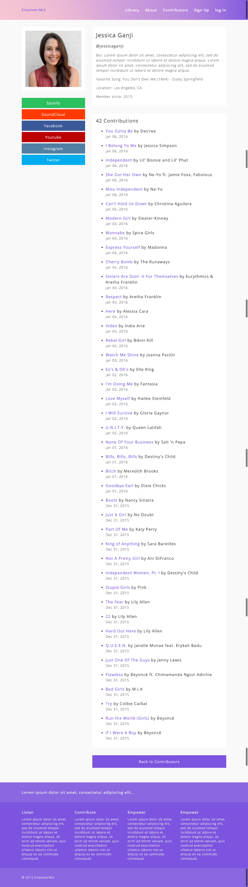
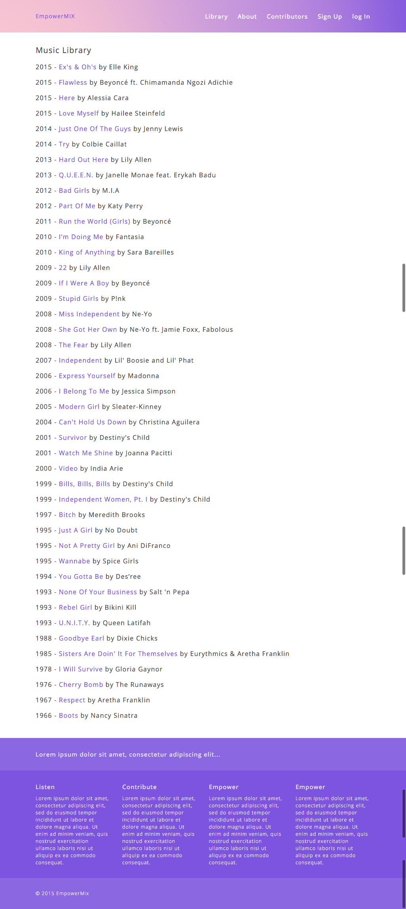
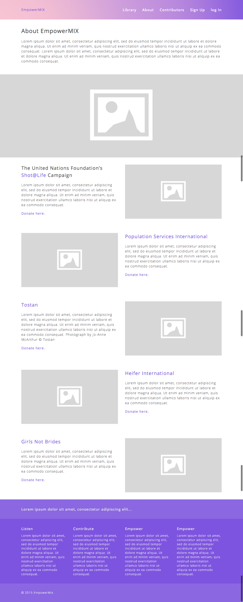

# EmpowerMIX 

When the patriarchy's got you down, turn up your EmpowerMIX!

If you fork this repo, you must run `bundle install` and `rake db:migrate` in order for the app to function properly.

[Visit EmpowerMIX on Heroku](https://empowermix.herokuapp.com/)

##### Inspired by: ["Measuring Up As Men: Mobilizing To End Child Marriage In Kenya"](https://www.youtube.com/watch?v=Nb--b4l_OZ8)

-

### Technologies Used

* Ruby 2.2.1
* PostgreSQL Database
* Rails 4.2.5 (Gem)
* Bcrypt (Gem)
* Paperclip (Gem)
* Acts As Votable (Gem)
* Social Share Button (Gem)
* Bootstrap-SASS (Gem)
* Custom CSS3/SaSS
* Adobe Creative Cloud (Photoshop + Illustrator)

-

#### Screenshots

##### Sign Up

##### User Profile

##### Music Library

##### About

-

#### User Stories

| Role ("As a..") | Context ("When I..") | Goal ("I want to..") | Benefit/Purpose ("So that I can..") |
|-----------------|----------------------|:--------------------:|:-----------------------------------:|
| Contributor | add a new song | use a youtube video | upload a video |
| Contributor | add a new song | use a youtube video | upload a video |
| Contributor | add a new song | use a youtube video | upload a video |

-

#### ERD

-

#### Wireframes

