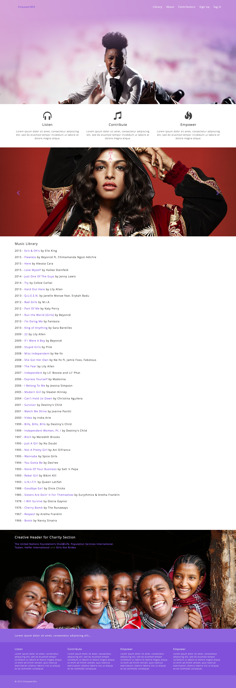
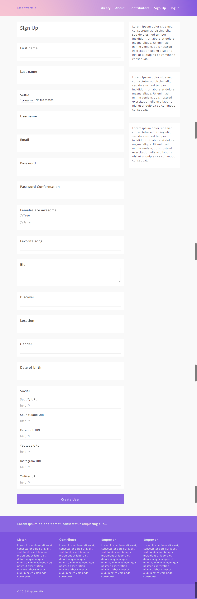
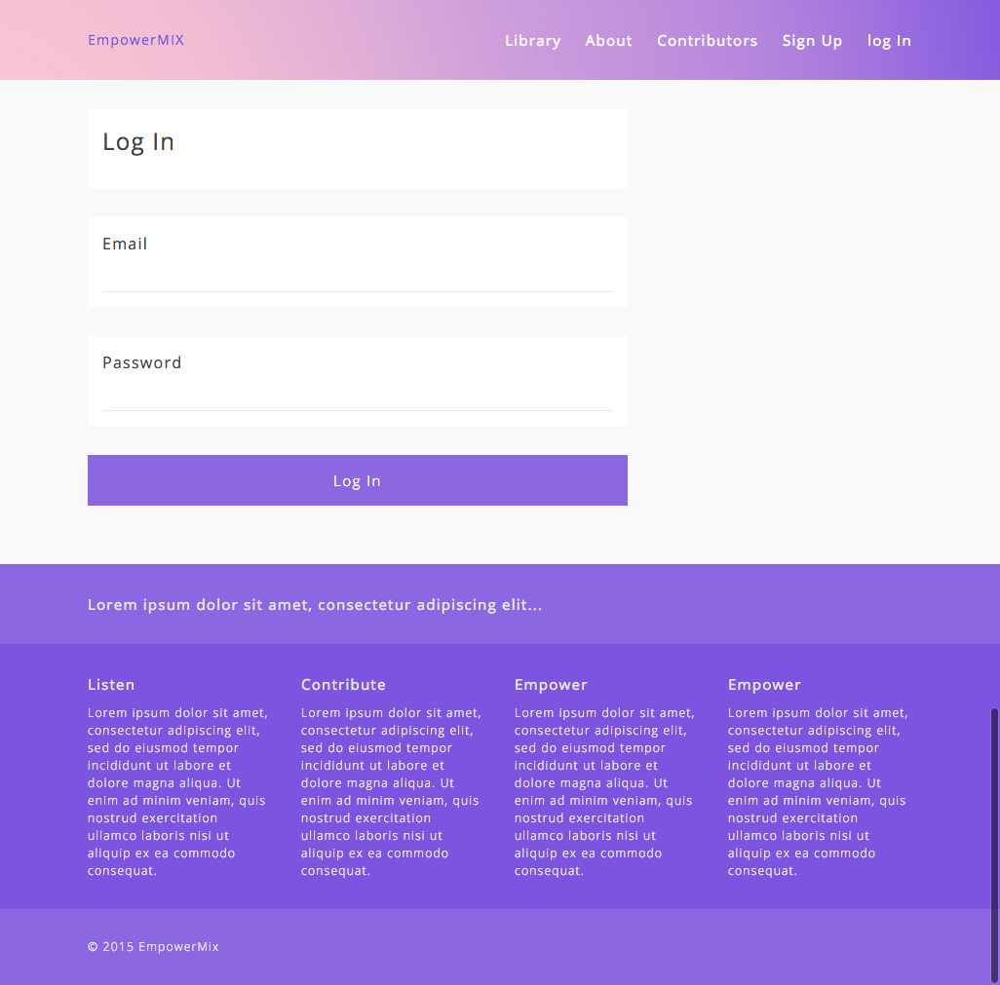
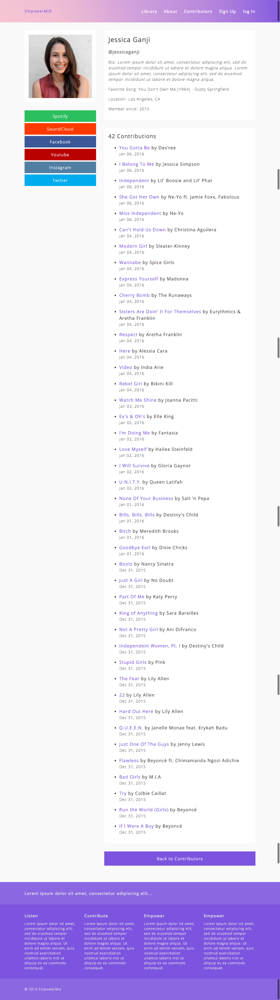
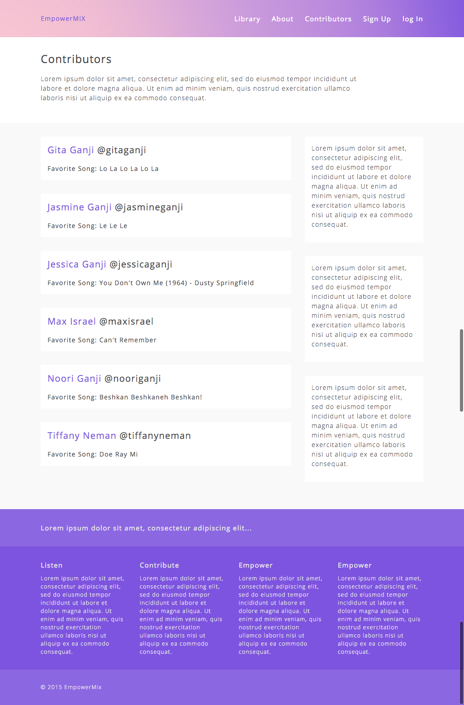
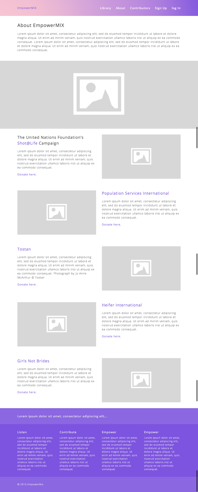
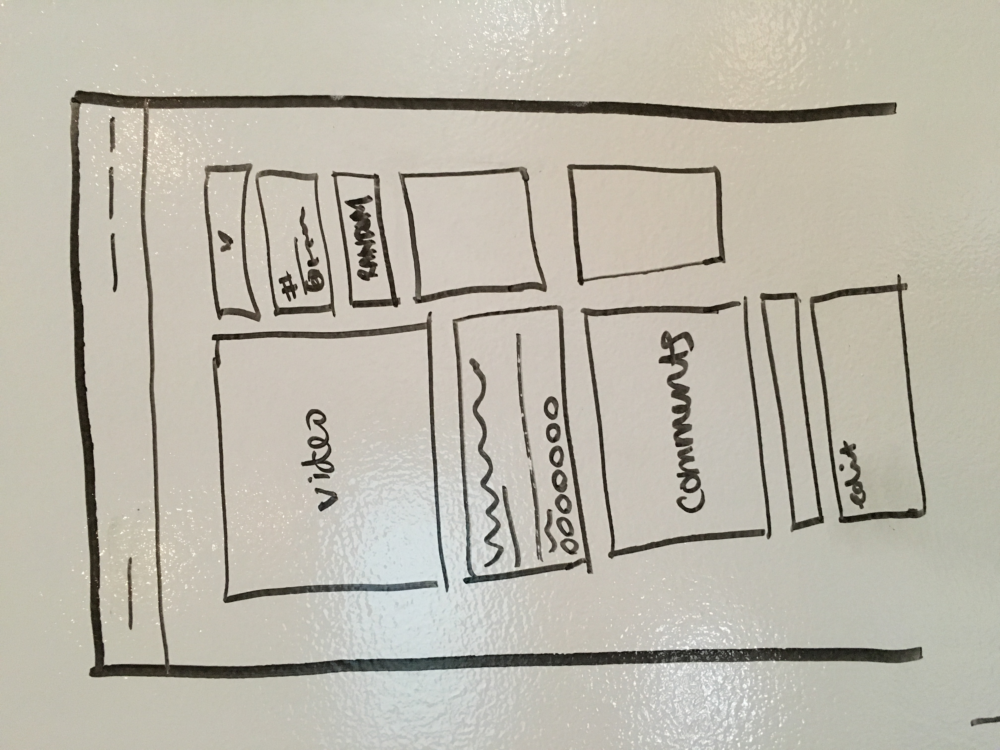
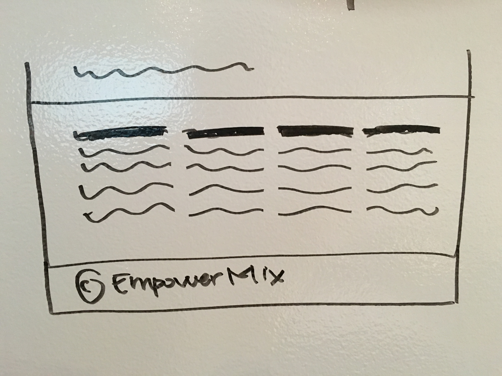
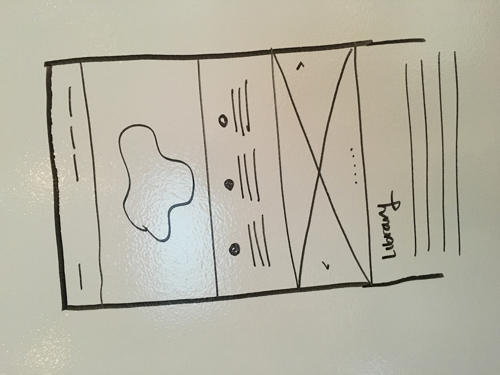
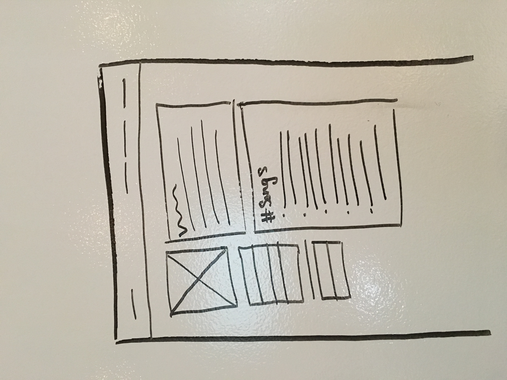

# EmpowerMIX

When the patriarchy's got you down... turn up your empowerMIX. 

#### Technologies Used

* Ruby 2.2.1

* Rails 4.2.5

* PostgreSQL Database

* Bootstrap-SASS ~> 3.3.4 (Gem)

* Acts As Votable, '~> 0.10.0' (Gem)

* Paperclip (Gem)

* Social Share Button (Gem)

#### Visit EmpowerMIX

[EmpowerMIX on Heroku](https://empowermix.herokuapp.com/)

#### Welcome

If you fork this repo, you must run `bundle install` and `rake db:migrate` in order for the app to function properly.

#### Sign Up

#### Log In

#### User Profile

#### Users

#### Music Library

#### About

#### Wireframes

